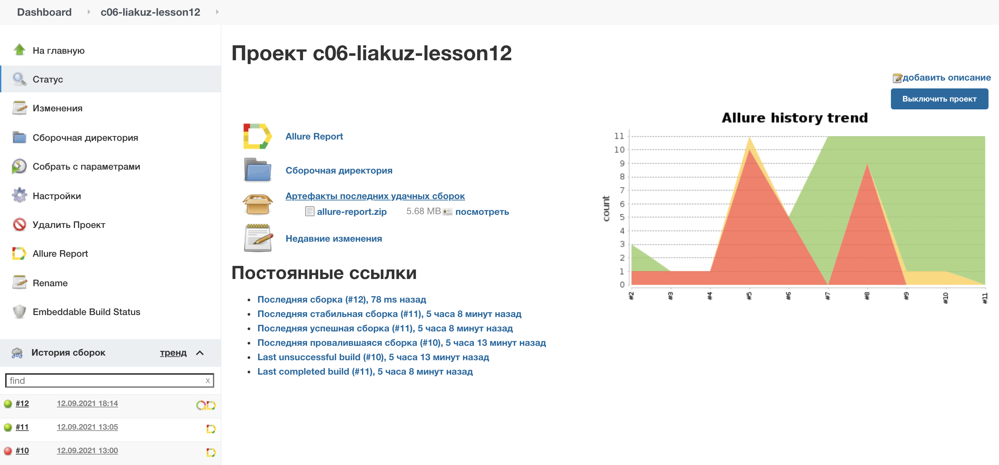
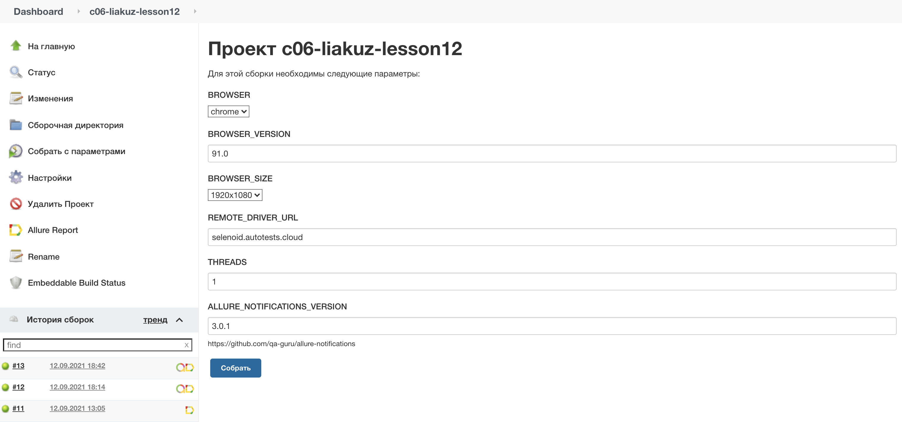
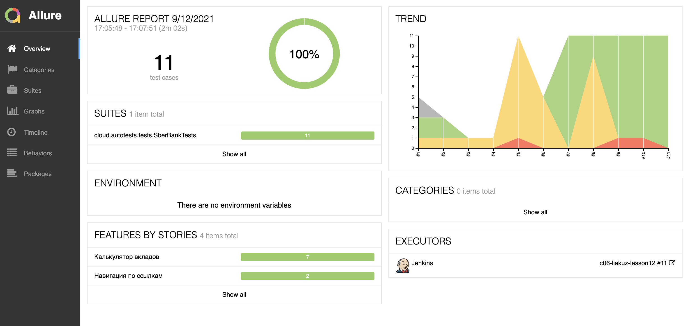
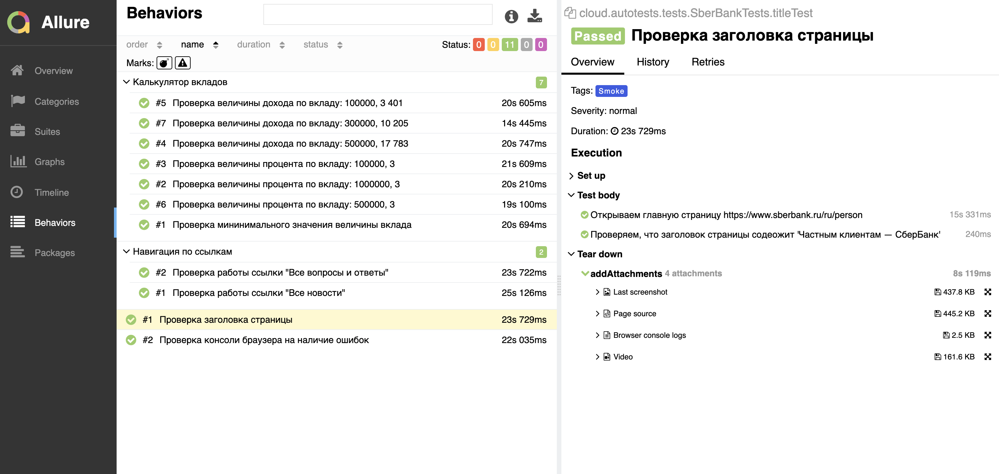
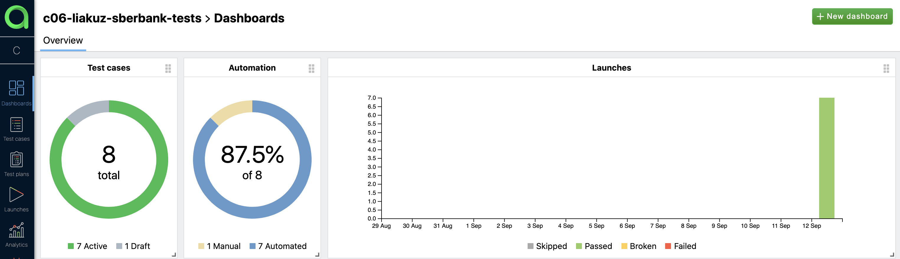
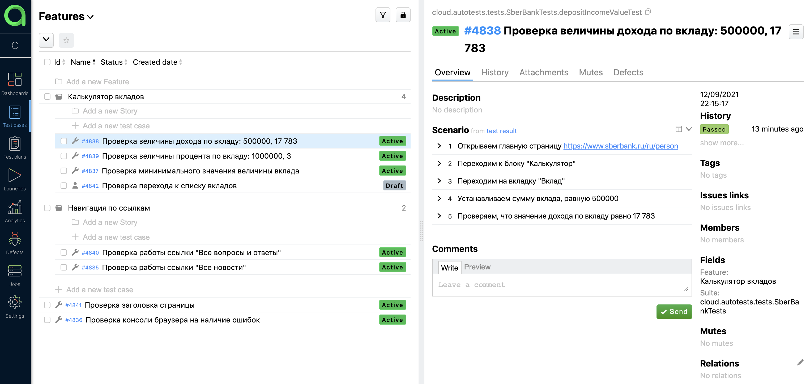
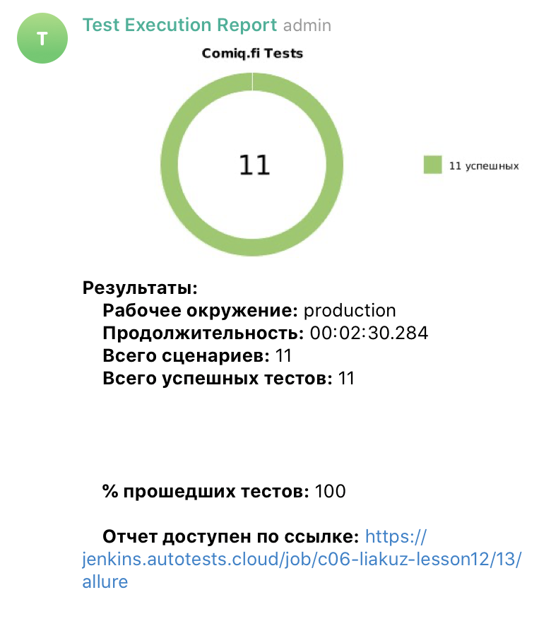

# Проект по автоматизации тестирования ресурса "Частным клиентам — СберБанк" (https://www.sberbank.ru/ru/person)

### Используемые технологии и инструменыт:
<p align="left">


</p>

### Реализованы следующие UI проверки:
- [X] Проверка мининимального значения величины вклада
- [X] Проверка величины дохода по вкладу
- [X] Проверка величины процента по вкладу
- [X] Проверка работы ссылки "Все вопросы и ответы"
- [X] Проверка работы ссылки "Все новости" 
- [X] Проверка заголовка страницы
- [X] Проверка консоли браузера на наличие ошибок

### Запуск тестов с использованием Jenkins </br>

#### Параметры, необходимые для запуска:


### Allure отчет для отображения результатов тестирования </br>
#### Общая информация

#### Список тестов c описанием шагов и визуализацией результатов


### Пример запуска теста на Selenoid </br>


### Интеграция с Allure TestOps и Jira </br>



### Уведомления в telegram о результатах теста </br>


Запуск тестов с заполненным remote.properties:
```bash
gradle clean test
```

Запуск тестов без заполненного remote.properties:
```bash
gradle clean -DremoteDriverUrl=https://%s:%s@selenoid.autotests.cloud/wd/hub/ -DvideoStorage=https://selenoid.autotests.cloud/video/ -Dthreads=1 test
```

Сформировать allure отчет:
```bash
allure serve build/allure-results
```

:heart: <a target="_blank" href="https://qa.guru">qa.guru</a><br/>
:blue_heart: <a target="_blank" href="https://t.me/qa_automation">t.me/qa_automation</a>
